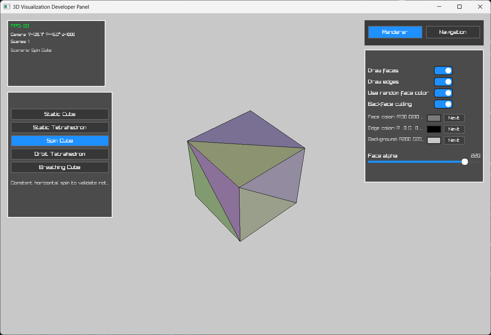

# 3D Viewer Application

A Go-based application for rendering and interacting with 3D models.
The project is currently in its early stages.

---

## Features

- **geom library**: Geometric entities for moddleing.
- **3D Model Rendering**: Displays a test mesh (tetrahedron) with correctly oriented faces.
- **Camera Control**: Includes basic camera functionalities like rotation and perspective.

---

## Installation

1. Clone the repository:
   ```bash
   git clone https://github.com/zschora/3D-Vis.git
   ```
2. Navigate to the project directory:
   ```bash
   cd 3D-Vis
   ```
3. Ensure you have Go installed (version 1.20 or later).
4. Install dependencies:
   ```bash
   go mod tidy
   ```
5. Run the application:
   ```bash
   go run main.go
   ```

---

## Roadmap

- [ ] Add support for loading external 3D files (e.g., STL, OBJ).
- [ ] Improve renderer functionality.
- [ ] Implement lighting and shading.
- [ ] Improve camera controls for smoother interaction.
- [ ] Introduce a GUI for easier user interaction.

---

## Contributing

Contributions are welcome! Please follow these steps:

1. Fork the repository.
2. Create a new branch for your feature or bugfix:
   ```bash
   git checkout -b feature/new-feature
   ```
3. Commit your changes:
   ```bash
   git commit -m "feat: add new feature"
   ```
4. Push your branch:
   ```bash
   git push origin feature/new-feature
   ```
5. Create a Pull Request.

---

## License

This project is licensed under the MIT License. See the [LICENSE](LICENSE) file for details.

---

## Acknowledgements

- Built using [Raylib-go](https://github.com/gen2brain/raylib-go) for rendering.
- Inspired by the desire to create a simple and efficient 3D viewer.

---

## Screenshots


